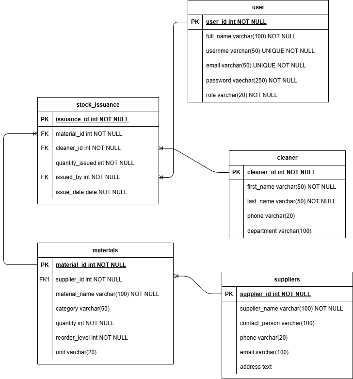
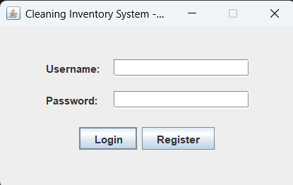
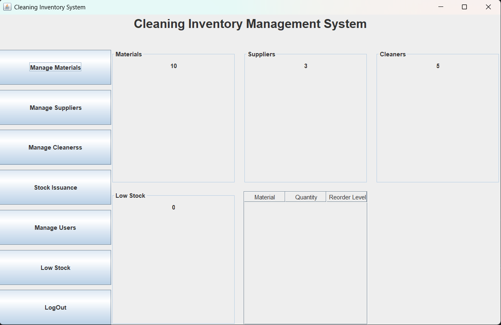
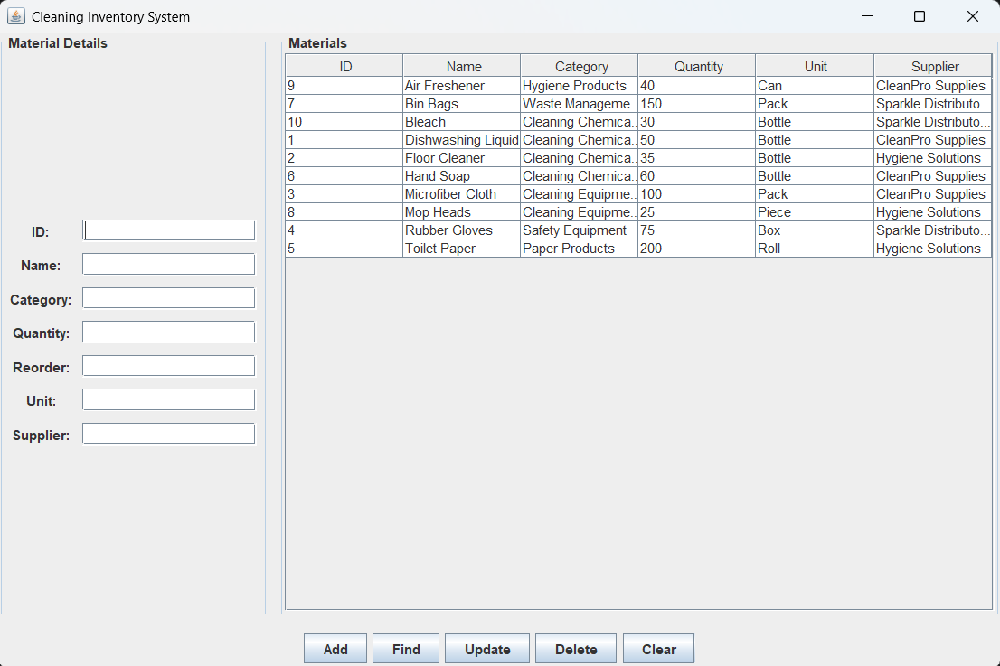
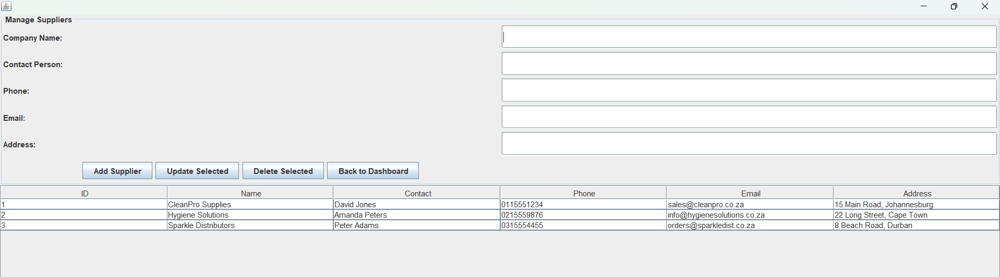
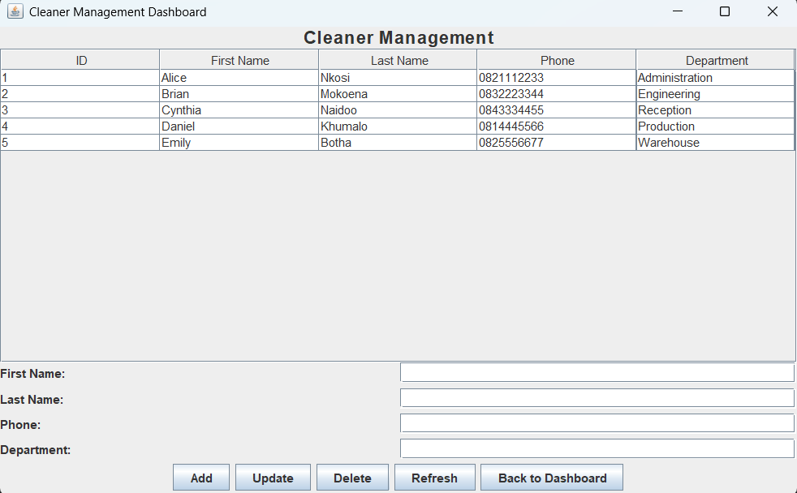

# 🧹 Cleaning Inventory Management System

A Java desktop application developed as part of the Software Engineering module at Belgium Campus ITversity.

The Cleaning Inventory Management System helps organisations manage cleaning materials, suppliers, cleaners, and stock issuance. The system keeps track of inventory levels, records material distribution to cleaners, and alerts users when stock falls below the reorder level.

---

## 📖 Project Overview

The purpose of this project is to provide a centralized system for managing cleaning inventory while applying Object-Oriented Programming (OOP) principles, layered architecture, and database integration.

The application allows authorized users to:

- Manage cleaning materials
- Manage suppliers
- Manage cleaners
- Record stock issuance
- Monitor inventory levels
- View low stock items
- Store all information in a PostgreSQL database

---

## 🚀 Features

### Material Management
- Add new materials
- Update existing materials
- Delete materials
- Search for materials
- View all materials
- Low stock notifications

### Supplier Management
- Add suppliers
- Update supplier information
- Delete suppliers
- Search suppliers

### Cleaner Management
- Register cleaners
- Update cleaner details
- Delete cleaners

### Stock Issuance
- Issue cleaning materials
- Record issue date
- Record issuing staff member
- Track issued quantities

### User Management
- User login
- User roles
- Inventory management permissions

---

# 🛠 Technologies Used

| Technology | Purpose |
|------------|---------|
| Java 21 | Programming Language |
| Java Swing | Desktop GUI |
| Maven | Dependency Management |
| PostgreSQL | Database |
| JDBC | Database Connectivity |
| IntelliJ IDEA | IDE |
| Git | Version Control |
| GitHub | Source Code Management |

---

# 🏛 Project Architecture

The application follows a layered architecture.

```
Presentation Layer (GUI)
        │
        ▼
Controller Layer
        │
        ▼
Service Layer
        │
        ▼
DAO Layer
        │
        ▼
PostgreSQL Database
```

---

# 📂 Project Structure

```text
CleaningInventorySystem
│
├── src
│   ├── main
│   │   ├── java
│   │   │
│   │   ├── controller
│   │   ├── dao
│   │   ├── model
│   │   ├── service
│   │   ├── util
│   │   ├── view
│   │   └── main
│   │       └── Main.java
│   │
│   └── resources
│       ├── database.properties
│       ├── Create_Database.sql
│       ├── SampleData_Materials.sql
│       └── SampleData_System.sql
│
├── pom.xml
└── README.md
```

# 🗄 Database Design

The application uses PostgreSQL.

### Tables

- Users
- Suppliers
- Materials
- Cleaners
- Stock Issuance

---

# 📊 Entity Relationship Diagram (ERD)



---

# 🖥 Application Screenshots

## Login Screen

> Replace with screenshot



---

## Dashboard

> Replace with screenshot



---

## Material Management

> Replace with screenshot



---

## Supplier Management

> Replace with screenshot



---

## Cleaner Management

> Replace with screenshot



---

## Stock Issuance

> Replace with screenshot


---

# ⚙ Installation

## Clone the repository

```bash
git clone https://github.com/yourusername/CleaningInventorySystem.git
```

---

# ⚙ Database Setup

The SQL files required to set up the database are located in:

```
src/main/resources
```

### Step 1

Create a PostgreSQL database named:

```
CleaningInventoryDB
```

### Step 2

Run the SQL files in the following order:

1. `Create_Database.sql`
2. `SampleData_System.sql`
3. `SampleData_Materials.sql`

> Ensure the database schema is created before inserting the sample data.

## Run the project

Open the project in IntelliJ IDEA and run:

```
Main.java
```

---

# 👥 Contributors

| Name | Student Number | Role | Responsibilities |
|------|----------------|------|------------------|
|Dristen Erasmus Albertus Venter| 601719 | Project Manager | Project coordination |
|Freerk van den BOS | 602074 | Materials Module | Materials CRUD, DAO, Service, Controller |
| Christian Jansen van Rensburg | 601840 | Suppliers Module | Supplier management |
|Refilwe Segele| 603241 | Cleaners Module | Cleaner management |
| Marco Armando Rensburg | 602792 | Stock Issuance Module | Inventory issuance |

---


# 📜 License

This project was developed for educational purposes as part of the Bachelor of Computing programme at Belgium Campus ITversity.

---

# 🙏 Acknowledgements

- Belgium Campus ITversity
- Module Lecturer
- PostgreSQL
- Oracle Java
- Apache Maven
- IntelliJ IDEA
- All contributers
